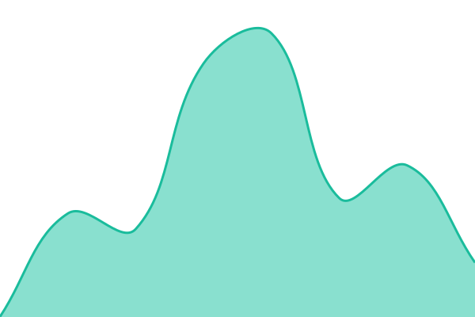
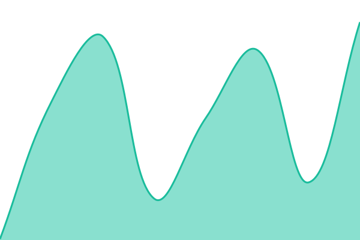
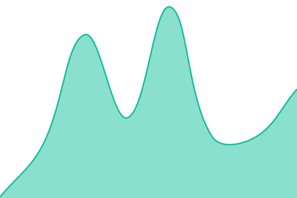
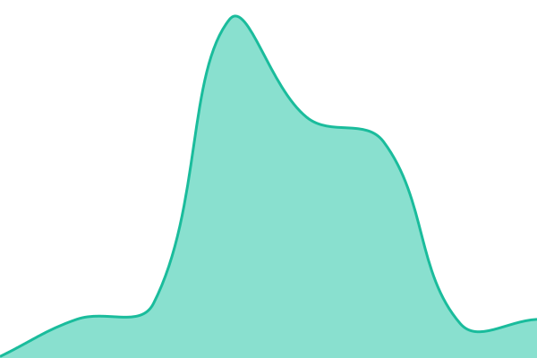
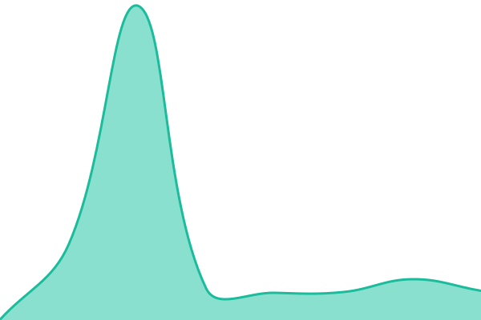

# [📈 Live Status](https://status.yorkyang2333.top): <!--live status--> **🟧 Partial outage**

This repository contains the open-source uptime monitor and status page for [York Yang](https://status.yorkyang2333.top), powered by [Upptime](https://github.com/upptime/upptime).

With [Upptime](https://upptime.js.org), you can get your own unlimited and free uptime monitor and status page, powered entirely by a GitHub repository. We use [Issues](https://github.com/yorkyang2333/upptime/issues) as incident reports, [Actions](https://github.com/yorkyang2333/upptime/actions) as uptime monitors, and [Pages](https://status.yorkyang2333.top) for the status page.

<!--start: status pages-->
<!-- This summary is generated by Upptime (https://github.com/upptime/upptime) -->
<!-- Do not edit this manually, your changes will be overwritten -->
<!-- prettier-ignore -->
| URL | Status | History | Response Time | Uptime |
| --- | ------ | ------- | ------------- | ------ |
|  [My Site](https://yorkyang2333.top) | 🟩 Up | [my-site.yml](https://github.com/yorkyang2333/upptime/commits/HEAD/history/my-site.yml) | 

 740ms
     
 | 

<a href="https://status.yorkyang2333.top/history/my-site">100.00%</a>
    

|  [Apple](https://www.apple.com) | 🟩 Up | [apple.yml](https://github.com/yorkyang2333/upptime/commits/HEAD/history/apple.yml) | 

 205ms
     
 | 

<a href="https://status.yorkyang2333.top/history/apple">100.00%</a>
    

|  [Google](https://www.google.com) | 🟩 Up | [google.yml](https://github.com/yorkyang2333/upptime/commits/HEAD/history/google.yml) | 

 159ms
     
 | 

<a href="https://status.yorkyang2333.top/history/google">100.00%</a>
    

|  [GitHub](https://github.com) | 🟩 Up | [git-hub.yml](https://github.com/yorkyang2333/upptime/commits/HEAD/history/git-hub.yml) | 

 385ms
     
 | 

<a href="https://status.yorkyang2333.top/history/git-hub">100.00%</a>
    

|  [Microsoft](https://microsoft.com) | 🟥 Down | [microsoft.yml](https://github.com/yorkyang2333/upptime/commits/HEAD/history/microsoft.yml) | 

 149ms
     
 | 

<a href="https://status.yorkyang2333.top/history/microsoft">50.85%</a>
    

|  [Vercel](https://vercel.com) | 🟩 Up | [vercel.yml](https://github.com/yorkyang2333/upptime/commits/HEAD/history/vercel.yml) | 

 298ms
     
 | 

<a href="https://status.yorkyang2333.top/history/vercel">100.00%</a>
    

<!--end: status pages-->

[**Visit our status website →**](https://status.yorkyang2333.top)

## 📄 License

- Powered by: [Upptime](https://github.com/upptime/upptime)
- Code: [MIT](./LICENSE) © [Anand Chowdhary](https://anandchowdhary.com)
- Data in the `./history` directory: [Open Database License](https://opendatacommons.org/licenses/odbl/1-0/)
